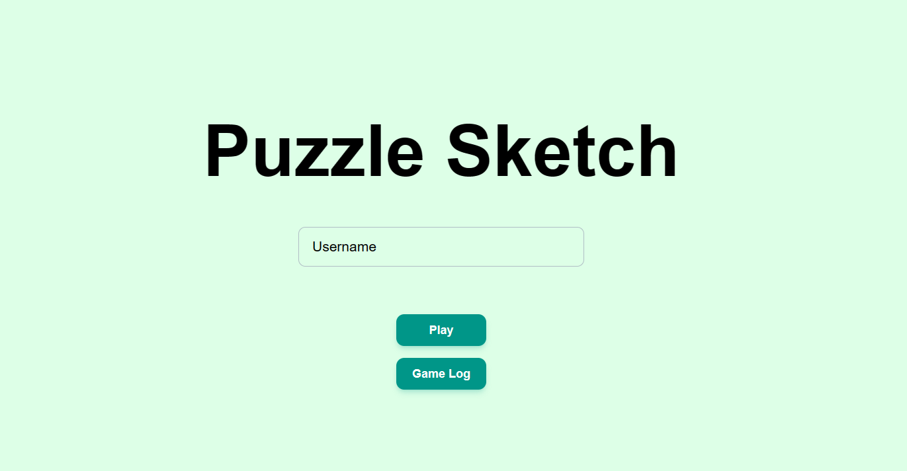
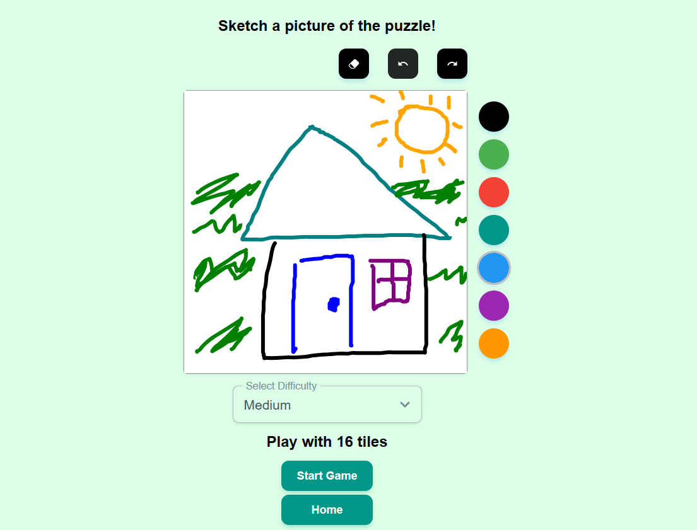
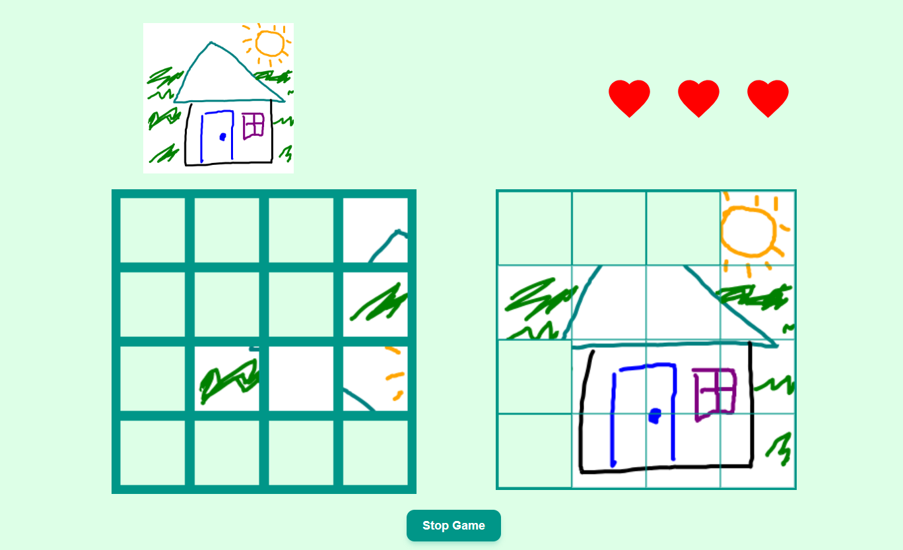
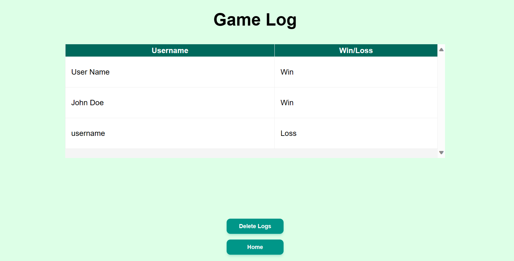

# Puzzle Sketch

Puzzle Sketch is a game where users can design puzzles with a drawing canvas. After finishing their sketches, users can attempt to solve their own puzzles. Players start each game with three hearts. Placing a tile in the wrong spot will deduct one heart. However, placing a tile in the correct spot will restore one heart. Players can have a maximum amount of 3 hearts. Puzzle Sketch records each win/loss to a game log database. Users can access this database and view their gameplay history.

This project employs a Go REST API, MySQL database, and React TypeScript UI. It uses Docker to bundle the respective images into a multi-container application. Regarding the full-stack aspect, the REST API supports data interactions between the MySQL database and the web app.

For frontend testing, the project deployed a continuous integration workflow with Github Actions and Jest. This process verifies the UI components' functionalities with a series of Jest unit tests. It runs when developers create pull requests or push commits to the main branch.

## Gallery

<p align="center">




</p>

## Tech Stack

- React
- TypeScript
- Docker
- GitHub Actions
- Go
- MySQL
- SQL
- Tailwind CSS
- Material Tailwind UI
- Jest
- Vite

## Setup

- Install npm, docker, and docker-compose
- Install MySQL WorkBench to interact with the database (optional step)
- Clone the repo
- Change directory to the `frontend` folder
- Run `npm install`

## Docker Deployment

The frontend and backend configurations can be found in the docker-compose yml file.
To start the Docker app, run the following command:

```
docker compose up -d --build
```

Frontend (http://localhost:5173) and backend (http://localhost:8080/logs) can be accessed via localhost. If MySQL Workbench is installed, you can access the database at localhost's port: 3307.

## Local Frontend Development

- Change directory to the `frontend` folder
- Run `npm run dev`

Frontend can be accessed at http://localhost:5173/.

## Testing with Jest

The unit tests are located in the `frontend/tests` folder. The GitHub Action file (`jest-unit-tests.yml`) can be found in the `.github/workflows` folder. Each UI page has a corresponding test file. The tests verify if the components render properly for different scenarios. The tests also mock queries and mutations to simulate frontend's data interactions.

## Backend

The Go API's source code is located in the `backend/go-api` folder.

## Sources

The puzzle piece logo can be found in [SVGRepo](https://www.svgrepo.com/svg/28073/puzzle-piece). This image has a CC0 license.
